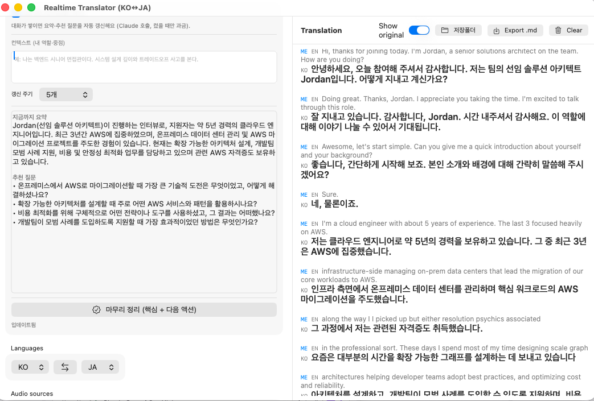

# Realtime Translator (KO ↔ JA ↔ EN)

A Mac app that captures **system audio (what you hear) + your microphone** and shows
**live, on-screen translation** — powered entirely by **self-hosted open-weight**
models on a GPU box you own. Built for meetings/calls (Zoom, etc.): one person
captures, and the whole team can watch the subtitles in a browser (**broadcast mode**).

Default pair is **Korean ↔ Japanese** (it auto-detects which side spoke); **English**
is also supported, and any pair works as long as the models do. The app's own
interface (labels, insight, history) also speaks **Korean / Japanese / English**.

> **New here? / 처음이신가요?** — [**QUICKSTART.md**](QUICKSTART.md) is a one-page intro + how-to-use, in English and Korean. This README is the full technical reference.



```
 ┌─ Mac app (Swift/SwiftUI) ─────────────┐        ┌─ Relay (Python, asyncio) ─┐      ┌─ Open models (GPU) ─────────┐
 │  System audio  (ScreenCaptureKit)  ───┼─ wss ─▶│  per-stream VAD            │─────▶│ faster-whisper large-v3 (ASR)│
 │  Microphone    (AVAudioEngine)     ───┤        │  endpointing + buffering  │      │ Qwen3-32B-AWQ via vLLM  (MT) │
 │  live subtitle UI  ◀──────────────────┼─ JSON ─┤  translate + context      │◀─────│ (OpenAI-compatible :8000)    │
 └───────────────────────────────────────┘  {interim,final}                   │      └─────────────────────────────┘
                                              └─ fan-out ─▶ N browser viewers (/view)  ← broadcast mode
```

- **No paid hosted API required.** OpenAI Realtime / Gemini Live are closed APIs — you
  can't put *their* model on *your* server. This hosts the strongest **open** stack
  (Qwen3) instead, so all audio stays on infrastructure you control. (Optionally, you can
  flip translation to **Claude Sonnet 4.6 on Bedrock** for higher accuracy — still in
  *your* AWS account.)
- **No mid-sentence cutting.** The classic "translation chops my sentence in half"
  problem is an **endpointing/VAD** problem, not a model one — solved here (see below).
- **Cost-guarded personal server.** The GPU box **auto-stops when idle** and the app
  **wakes it on demand**, so you can leave it "always available" without paying 24/7.

---

## Table of contents
- [Features](#features)
- [How it works](#how-it-works)
- [The "sentences get cut in half" problem](#the-sentences-get-cut-in-half-problem--solved-here)
- [Using the Mac app](#using-the-mac-app)
- [Live insight (meeting copilot)](#live-insight-meeting-copilot)
- [Broadcast mode (team viewing)](#broadcast-mode-team-viewing)
- [Personal always-available server (auto-stop + wake)](#personal-always-available-server-auto-stop--wake)
- [Quick start (local, no cloud)](#quick-start-local-no-cloud)
- [Deploy the GPU box (Tokyo)](#deploy-the-gpu-box)
- [Deploying to *your own* AWS account](#deploying-to-your-own-aws-account)
- [Configuration knobs](#configuration-knobs)
- [Repo layout](#repo-layout)
- [Troubleshooting](#troubleshooting)

---

## Features

| Area | What you get |
|---|---|
| **Capture** | System audio **and** mic, as **two independent streams** (mixing them wrecked recognition). Mic = "🎙 Me", system = "🔊 Them", tagged in the UI. |
| **ASR** | `faster-whisper large-v3` on GPU; CPU `small`/`base` for local demo. |
| **Translation** | `Qwen3-32B-AWQ` via vLLM (free/offline), **or** `Claude Sonnet 4.6` on Amazon Bedrock (higher accuracy) — toggle live in the app. On a Bedrock throttle it auto-falls-back to Qwen for that call so subtitles never blank. Carries the last few sentences as **context** so pronouns/topic stay coherent. |
| **Anti-cut** | VAD endpointing waits for a real pause before locking a sentence; punctuation/sentence-ending early-finalize keeps long monologues breaking per sentence; an **English-target gate** keeps SVO clauses whole. A live grey **interim** line updates as you speak, then commits to a solid **final**. All tunable live from the app. |
| **Live insight (copilot)** | An opt-in panel that reads the rolling transcript + your free-text **context** ("I'm the interviewer, focus on system-design depth") and shows a **live summary + suggested next questions**, plus a one-tap **wrap-up** (key points + next actions). Toggle off ⇒ no calls ⇒ zero added cost. |
| **Broadcast** | One capturer → relay translates **once** → **N browser viewers** watch subtitles at `/view` (no app, no permissions, just a URL + password). |
| **Auth** | Single shared password (token). Required on every connection — capture app and viewers alike. |
| **Auto-save** | Every finalized line is written to `~/Documents/RealtimeTranslator/transcript-*.md` the instant it arrives — quit/crash never loses the transcript. |
| **Multilingual UI** | App interface in **Korean / Japanese / English** (picker, top-right). Every label, button, hint and status message is localized; first launch guesses from the macOS system language, then your pick is remembered. The **live insight + end-of-session summary** are generated in the chosen language, and the room **history page** (`/history`) is trilingual too. |
| **Cost guard** | GPU box **self-stops after 15 min idle** (never mid-meeting), **wakes on demand** from the app, and reports readiness so the app auto-starts when the model is loaded. |

---

## How it works

1. The Mac app opens **two WebSocket connections** to the relay — one for the mic,
   one for system audio. Each sends raw 16 kHz PCM16. They're kept separate on
   purpose: summing mic + system audio produced garbage recognition.
2. The relay runs **per-connection VAD endpointing** (`segmenter.py`): it detects
   speech, buffers an utterance, emits **interim** re-transcriptions while you talk,
   and a **final** when you pause long enough.
3. Each segment goes to **whisper** (ASR), then to **Qwen3 via vLLM** (translation),
   with recent sentences as context. The result `{interim|final, source, translation}`
   is sent back to the app **and** fanned out to any **browser viewers**.
4. Everything is gated by a **shared token**; the GPU box is reachable only through
   **CloudFront** (no raw public port).

---

## The "sentences get cut in half" problem — solved here

This is an **endpointing/VAD** problem, not a model problem. The relay listens
**longer** before deciding a sentence ended, and re-translates as more audio arrives.
Three mechanisms work together (all live-tunable from the app, no redeploy):

1. **Silence endpointing** — a sentence locks only after a real pause (`RT_MIN_SILENCE_MS`).
2. **Punctuation / sentence-ending early-finalize** — if the interim transcription
   ends a sentence (Whisper punctuation, or a KO/JA sentence-final ending) *and* there's
   a tiny breath, finalize now — so a 1–2 min monologue still breaks per sentence
   instead of waiting out the pause.
3. **English-target gate** — KO/JA are SOV, so cutting at a mid-utterance breath is
   harmless; English (SVO) reordering can't cross a wrong cut, so a half sentence
   becomes a dangling phrase. When the pair involves **English**, a bare pause does
   **not** finalize — only a complete sentence (or the max-segment net) does, keeping
   the clause whole. KO↔JA is unaffected (stays snappy). Toggleable per session.

| Knob | Default | Effect |
|---|---|---|
| `RT_MIN_SILENCE_MS` | `650` | **The main one.** Pause length required to *lock* a sentence. Raise if it still splits; short "음…"/comma pauses won't finalize. Live: the app's "문장 끊기" slider. |
| `RT_MAX_SEGMENT_MS` | `8000` | Safety flush for a non-stop talker. |
| `RT_PUNCT_ENDPOINT` / `RT_PUNCT_SILENCE_MS` | `1` / `300` | Punctuation-aware early finalize on/off, and the tiny pause required to confirm it. |
| `RT_EN_SENTENCE_GATE` | `1` | English-target gate (keep SVO clauses whole). |
| `RT_PREROLL_MS` | `300` | Audio kept *before* speech onset so the first syllable isn't clipped. |
| `RT_MIN_SPEECH_MS` | `300` | Ignore coughs/blips below this. |
| `RT_INTERIM_INTERVAL_MS` | `1000` | How often the grey in-progress line refreshes. |
| `RT_VAD_AGGRESSIVENESS` | `2` | webrtcvad 0–3; higher = calls quiet bits silence sooner. |

> The relay also exposes a live control endpoint `GET /control/endpoint?silence_ms=&max_ms=&punct=&punct_ms=&en_gate=` (token-gated) that the app's sliders/toggles drive — change behavior mid-meeting without a redeploy.

---

## Using the Mac app

1. **Server** — the WebSocket URL of your relay, e.g. `wss://<your-cloudfront>.cloudfront.net`
   (or `ws://localhost:8765` for local).
2. **Password** — the shared token (`deploy/.relay-token`). Enter it in the password
   field. *(Older builds without a password field: append it to the URL instead, as
   `wss://host/?token=YOUR_TOKEN`.)*
3. **Languages** — pick the pair (KO/JA/EN); the relay auto-detects which side spoke.
4. **Audio sources** — leave **System audio** + **Microphone** on; pick input/output devices.
5. Press **Start** (or **Wake & Start**, see below). The status dot turns **green/Connected**;
   speak or play a video and subtitles appear.

> **Permissions (first launch):** macOS asks for **Microphone** and **Screen Recording**
> (system-audio capture rides on the screen-recording grant). Approve both in
> System Settings → Privacy & Security, then relaunch.

> **Build/sign:** `mac-app/bundle.sh` builds a signed `.app`. It signs with a stable
> *Apple Development* identity so the code hash stays constant across rebuilds —
> otherwise macOS resets your Mic/Screen-Recording grants on every build.

**Live controls** (no redeploy — they hit token-gated `/control/*` endpoints):
- **자동 끄기 (cost guard):** toggle idle auto-stop, change the timeout, or "지금 서버 끄기" to stop the box immediately.
- **번역 모델:** switch translation between local **Qwen** and **Claude Sonnet 4.6 (Bedrock)**.
- **문장 끊기:** a silence-sensitivity slider + punctuation-early-finalize toggle (see anti-cut above).
- **라이브 인사이트:** the meeting-copilot panel (next section).

All of these re-apply automatically after a wake (the box resets to env defaults on stop/start).

---

## Live insight (meeting copilot)

An **opt-in** assistant that reads the running transcript and helps you act on it in
real time — separate from translation, and **billed only while it's on**.

1. Turn on **"라이브 인사이트 켜기"** in the app.
2. Type your **context** — who you are and what you care about, e.g.
   *"나는 백엔드 시니어 면접관이다. 시스템 설계 깊이와 트레이드오프 사고를 본다."*
   This becomes part of the system prompt, so the output is tailored to your role.
3. As the conversation accumulates, every **N finals** (3/5/8/12, your choice) the app
   posts the recent transcript + context to the relay and updates a **live summary +
   suggested next questions** — tailored to your context (an interviewer gets
   system-design probes, not small talk).
4. Press **"마무리 정리"** any time for an end-of-meeting wrap: **key points + next
   actions**.

- **Model:** Claude Sonnet 4.6 on Bedrock. Output is always in **Korean**, regardless of
  the transcript's language.
- **Cost:** the toggle OFF means the app makes **no calls at all** — zero added cost. ON,
  it batches every N sentences and sends only recent lines, so calls stay small and
  predictable. (The GPU box cost is unchanged either way — only Bedrock calls are added,
  and only on demand.)
- **Privacy:** the transcript is sent to Bedrock in your account/region (`ap-northeast-1`)
  using the box's IAM role — no third-party API.
- Server side: token-gated `POST /insight` with `{context, transcript, mode:"live"|"final"}`;
  see `backend/translator.py` (`generate_insight`). Tunable via `RT_INSIGHT_*` env knobs.

---

## Broadcast mode (team viewing)

For meetings where **everyone should see the subtitles**: one person runs the Mac app
and captures the meeting's system audio; the relay translates **once** and fans the
subtitles out to any number of **browser viewers**.

- Viewers open **`https://<your-cloudfront>.cloudfront.net/view`**, enter the password once,
  and watch live — **no app, no permissions, no audio upload**. Server load is one stream
  regardless of viewer count.
- The capturer connects to `/` (capture socket); viewers connect to `/viewsock`. CloudFront
  routes `/view*` to the HTML page and the rest to the relay.

---

## Personal always-available server (auto-stop + wake)

A 32B model on an L40S costs ~$2/hr — fine in bursts, painful 24/7. So the box is set up
to be **"always available but only billed when used"**:

- **Auto-stop:** the relay self-stops after **15 min with zero capture sessions**
  (`RT_IDLE_STOP_S=900`, with a 10-min post-boot grace). A meeting keeps the mic+system
  capture sockets open, so **it never stops mid-meeting**. Browser viewers alone do *not*
  keep it alive. Implemented in `server.py` (`_idle_stop_loop` → `_self_stop`, via IMDSv2 +
  `ec2:StopInstances` scoped by tag).
- **Wake on demand:** an always-on **`rt-wake` Lambda** (reached only through CloudFront,
  IAM-signed via OAC) starts the box. Call it from the app or:
  ```bash
  curl "https://<your-cloudfront>.cloudfront.net/wake?token=YOUR_TOKEN"
  ```
- **Readiness:** the relay serves **`/healthz`** (booleans only). While the box is down
  CloudFront returns 5xx; once the relay is up but the 32B model is still loading you get
  `{"ready":false}`; when fully loaded, `{"ready":true}`.
- **App integration:** the **"Wake & Start"** button wakes the box, polls `/healthz`, plays
  a sound when ready, and auto-presses Start. **Cold wake → ready is ≈ 6 minutes** (mostly
  vLLM loading the 32B weights; stop/start preserves the kernel + model cache on EBS, so
  boot itself is fast).

> ⚠️ If you're on an **older app build without the Wake button**, a stopped box won't wake
> itself — you'll just see "no subtitles". Either rebuild/reinstall the app, or wake it
> manually with the `curl` above, then press Start.

---

## Quick start (local, no cloud)

```bash
# 1. Backend (CPU whisper + Ollama Qwen3)
brew install ollama
ollama serve                     # one terminal
cd backend && ./run_local.sh     # installs deps, pulls qwen3:8b, starts relay on :8765

# 2. Mac app
cd ../mac-app && ./bundle.sh
open RealtimeTranslator.app
```

In the app: server `ws://localhost:8765`, leave a blank password (local relay is open
by default), System audio + Microphone on, press **Start**.

---

## Deploy the GPU box

The whole box is provisioned by scripts in **`deploy/`** — **no SSH keys, no public ports**
(reachable only via SSM + CloudFront, per the no-public-exposure rule). It uses **whatever
AWS credentials your shell is logged into** (`aws sso login` / `aws configure`) — nothing
is hardcoded.

```bash
# one-time: create the access token the relay/app will share
echo "$(openssl rand -hex 12)" > deploy/.relay-token   # gitignored

deploy/launch.sh                 # package backend -> S3, IAM+SG+EIP, launch g6e.2xlarge in Tokyo
                                 #   (override size:  INSTANCE_TYPE=g6e.12xlarge deploy/launch.sh)
# wait for bootstrap to reach READY  (watch /var/run/rt-status over SSM)
deploy/wake-deploy.sh            # deploy the wake Lambda + wire it behind CloudFront

deploy/connect.sh                # optional: SSM port-forward ws://localhost:18765 (local dev)
deploy/teardown.sh stop          # stop billing  (or: terminate to delete)
```

What `launch.sh` builds:
- **AMI:** Deep Learning PyTorch 2.7 (Ubuntu 22.04) — or a recorded golden AMI for faster boot.
- **Instance:** `g6e.2xlarge` (1× L40S 48 GB) by default.
- **IAM:** `rt-translator-ec2-role` — SSM core, read-only on the deploy bucket, and
  **self-stop** (`ec2:StopInstances` scoped to `project=realtime-translator`).
- **SG:** `rt-translator-sg` with **zero inbound** — Session Manager + CloudFront origin only.
- **EIP:** a fixed Elastic IP so the CloudFront origin and app URL survive stop/start.
- **user-data:** pulls `backend/` from S3 and starts two systemd units — `rt-vllm`
  (Qwen3-32B-AWQ on :8000) and `rt-relay` (whisper large-v3 + WS on :8765, HTTP on :9000),
  bound to localhost. A readiness probe flips `/var/run/rt-status` to `READY`.

> **Pinned versions (don't bump blindly):** vLLM **0.22.1** + starlette **1.2.1** +
> fastapi **0.136.3**. Newer combos throw `'_IncludedRouter' object has no attribute 'path'`
> → HTTP 500 on every request. Pinned in `userdata.sh`.

> **GPU memory:** single-GPU box uses `--gpu-memory-utilization 0.78` (whisper shares the
> card with vLLM); multi-GPU uses `0.90` (vLLM gets GPU0 to itself). Auto-detected.

> **CloudFront routing (important):** the distribution's *default* origin is the WebSocket
> relay (`:8765`). The HTTP control/insight/health paths must each have a behavior pointing
> at the **HTTP origin (`:9000`)** — i.e. `/healthz*`, `/control*`, `/metrics*`, `/insight*`
> (plus `/view*`, `/wake*`). If `/control*` or `/insight*` is missing, those requests fall
> through to the WS origin and the app's controls/insight **silently fail with HTTP 426**.
> All of these forward query strings + the `X-Wake-Token` header (managed *AllViewerExceptHostHeader*
> origin-request policy) and disable caching.

---

## Deploying to *your own* AWS account

The credential model is already portable — **log into your account and run the scripts**:

```bash
aws sso login            # or: aws configure   (whatever puts valid creds in your shell)
deploy/launch.sh         # creates everything IN YOUR ACCOUNT (account ID is read at runtime)
```

There are **no hardcoded keys**. The only values tied to the original environment that you
may want to change:

| Value | Where | Change to |
|---|---|---|
| **Region** | `deploy/*.sh` (`REGION=ap-northeast-1`) | your region (most accept a `REGION=` override) |
| **App default server URL** | `mac-app/.../AppModel.swift` (`serverURL`) | your CloudFront domain — or just type it in the app's Server field at runtime |
| **Access token** | `deploy/.relay-token` (gitignored) | generate your own (`openssl rand -hex 12`) |
| **Golden AMI** | `deploy/.golden-ami` (gitignored) | leave empty — it falls back to the public DLAMI (`FORCE_DLAMI=1`) |

Everything else (account ID, instance IDs, distribution IDs) is created fresh in *your*
account at deploy time.

---

## Configuration knobs

All knobs are env-overridable so the **same code** runs locally and in Tokyo
(`backend/config.py`). See `backend/.env.local.example` and `backend/.env.tokyo.example`
for ready-to-copy sets. Highlights:

- **Endpointing:** `RT_MIN_SILENCE_MS`, `RT_MAX_SEGMENT_MS`, `RT_PREROLL_MS`,
  `RT_VAD_AGGRESSIVENESS`, `RT_INTERIM_INTERVAL_MS`, `RT_INTERIM_WINDOW_MS`,
  `RT_PUNCT_ENDPOINT`, `RT_PUNCT_SILENCE_MS`, `RT_EN_SENTENCE_GATE`.
- **ASR:** `RT_ASR_MODEL`, `RT_ASR_DEVICE`, `RT_ASR_COMPUTE`, `RT_ASR_WORKERS`, `RT_ASR_NUM_GPUS`.
- **Translation:** `RT_LLM_BASE_URL`, `RT_LLM_MODEL`, `RT_LLM_TEMPERATURE`, `RT_CONTEXT_WINDOW`.
- **Translation provider (Bedrock):** `RT_LLM_PROVIDER` (`vllm` | `bedrock`), `RT_BEDROCK_MODEL`
  (default `global.anthropic.claude-sonnet-4-6` — Sonnet 4.6 has **no `apac.` profile**, use
  `global.` or `jp.` in Tokyo), `RT_BEDROCK_REGION`, `RT_BEDROCK_MAX_TOKENS`.
- **Live insight:** `RT_INSIGHT_EVERY_N_FINALS`, `RT_INSIGHT_LIVE_MAX_TOKENS`,
  `RT_INSIGHT_FINAL_MAX_TOKENS`, `RT_INSIGHT_LIVE_LINES`, `RT_INSIGHT_FINAL_LINES`.
- **Auth:** `RT_RELAY_TOKEN` (empty = open dev relay).
- **Cost guard:** `RT_IDLE_STOP_S`, `RT_IDLE_GRACE_S`, `RT_IDLE_STOP_ENABLED`, `RT_IDLE_CHECK_S`.

> **Bedrock translation/insight needs IAM perms** — the EC2 role must allow `bedrock:InvokeModel`
> on the Claude Sonnet 4.6 model + inference profile (see `deploy/bedrock-policy.json`), and
> `anthropic[bedrock]` must be installed (it's in `requirements.txt`).

---

## Repo layout

```
backend/
  server.py          WebSocket relay (asyncio + websockets); auth, broadcast,
                     /healthz, /control/* live knobs, /insight, idle self-stop,
                     vLLM health watchdog
  segmenter.py       VAD endpointing — anti-cut logic (silence + punctuation + EN gate)
  asr.py             faster-whisper wrapper (multi-GPU via device_index)
  translator.py      Qwen (vLLM) + Claude (Bedrock) translation w/ fallback,
                     context window, and generate_insight() (meeting copilot)
  config.py          all tunable knobs (env-overridable)
  test_en_gate.py    offline unit tests for the segmenter (faked VAD)
  viewer.html        broadcast viewer page (vanilla JS, served at /view)
  run_local.sh       one-shot local launcher
  deploy_tokyo.md    GPU deploy notes
deploy/
  launch.sh          provision the box (IAM, SG, EIP, EC2, S3) in the current account
  userdata.sh        first-boot bootstrap (DLAMI path)
  userdata-golden.sh fast-boot bootstrap (golden AMI path; nvidia-smi DKMS guard)
  wake_lambda.py     always-on Lambda that starts the box on demand
  wake-deploy.sh     deploy the wake Lambda + wire it behind CloudFront (OAC)
  connect.sh         self-healing SSM port-forward supervisor (local dev)
  teardown.sh        stop / terminate the box
  cloudfront-teardown.sh   delete the CloudFront distribution + close the SG
  bedrock-policy.json      IAM policy for Claude Sonnet 4.6 (translation + insight)
mac-app/
  Sources/RealtimeTranslator/
    Audio/           Resampler, Mixer, SystemAudioCapture, MicCapture, AudioDevices
    Net/             RelayClient (WebSocket)
    Views/           ContentView (controls + Wake/Start + insight panel),
                     TranscriptView (live subtitles), SelectableText (NSTextView
                     wrapper for whole-area drag-select)
    AppModel.swift   main view model (capture, wake, readiness, autosave,
                     live controls, insight requests)
    main.swift       app entry
  bundle.sh          build + wrap into a signed .app (required for permissions)
  package-dmg.sh     wrap into a .dmg for distribution
VERSIONS.md          tagged restore points + per-version infra notes
TEAM_DEPLOY.md       team viewer guide (broadcast mode); .ja.md is the Japanese version
```

---

## Troubleshooting

- **No subtitles, status dot stays grey / "unauthorized":** the password (token) doesn't
  match. Stop, re-enter `deploy/.relay-token` in the password field (or `?token=` in the URL),
  Start again.
- **No subtitles right after opening the app:** the GPU box may have **auto-stopped** (15-min
  idle). Use **Wake & Start** (or `curl .../wake?token=...`), wait ~6 min for `ready:true`.
- **`active_connections: 0` in `/metrics`:** the app never connected — wrong URL, wrong
  token, or the box is down. Check `/healthz`.
- **vLLM 500s on every translation:** version drift — pin vLLM 0.22.1 / starlette 1.2.1 /
  fastapi 0.136.3.
- **GPU "no CUDA-capable device" on a fresh boot:** kernel/DKMS drift — the userdata gates on
  `nvidia-smi -L` and rebuilds DKMS for the running kernel. A simple stop/start of the *same*
  instance preserves the kernel and avoids this.
